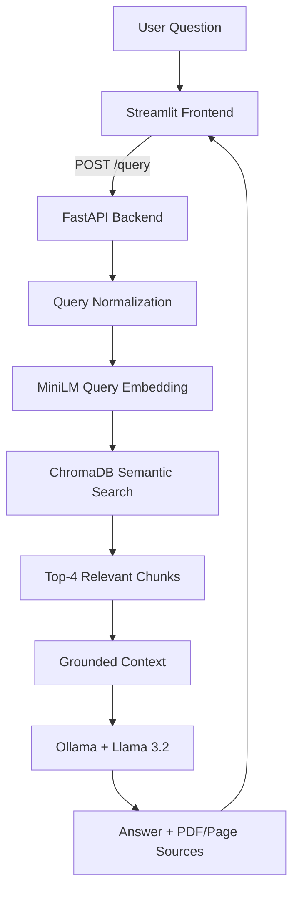
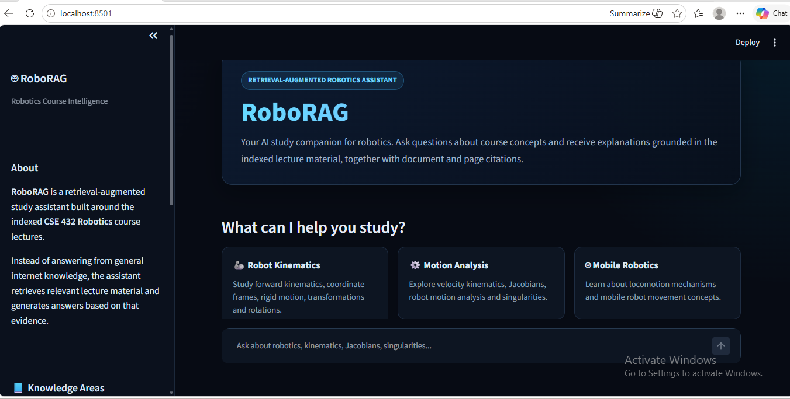
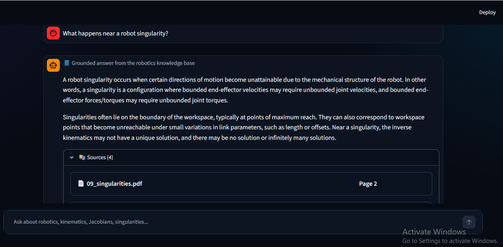
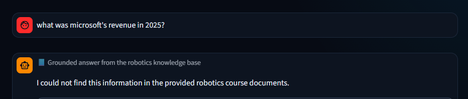
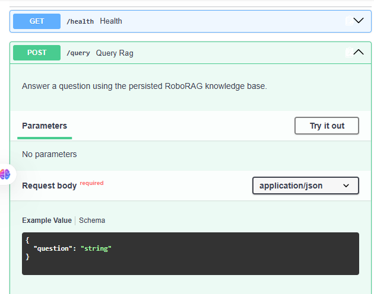

# 🤖 RoboRAG — Robotics Course Document Assistant

A full-stack **Retrieval-Augmented Generation (RAG)** application for studying robotics course material.

RoboRAG allows students to ask natural-language questions and receive answers grounded in the indexed robotics lectures, together with the **source PDF and page number** used to generate the answer.

The system uses **SentenceTransformers + ChromaDB** for semantic retrieval, **Llama 3.2 through Ollama** for local answer generation, **FastAPI** for the backend, and **Streamlit** for the user interface.

---

## ✨ Features

- Semantic search across robotics lecture PDFs
- Local RAG generation using **Llama 3.2 + Ollama**
- Embeddings with `sentence-transformers/all-MiniLM-L6-v2`
- Persistent **ChromaDB** vector store
- Exact **PDF filename + page number** citations
- Top-K semantic retrieval
- Query normalization for short robotics questions
- Out-of-domain question refusal
- FastAPI REST API
- Streamlit chat interface
- Loading and API error states
- Environment-based configuration
- Automated backend tests
- Manual RAG evaluation on supported and unsupported questions

---

## 🏗️ Architecture



### RAG Flow

```text
Question
   ↓
Query Normalization
   ↓
Query Embedding
   ↓
ChromaDB Retrieval
   ↓
Top-4 Relevant Chunks
   ↓
Grounded Prompt
   ↓
Llama 3.2 via Ollama
   ↓
Answer + Sources
```

---

## 🧰 Tech Stack

| Component | Technology |
|---|---|
| Language | Python 3.11 |
| LLM | Llama 3.2 |
| Local LLM Runtime | Ollama |
| Embeddings | SentenceTransformers |
| Embedding Model | `all-MiniLM-L6-v2` |
| Vector Database | ChromaDB |
| Backend | FastAPI |
| Validation | Pydantic |
| Frontend | Streamlit |
| HTTP Client | HTTPX |
| Testing | Pytest / FastAPI TestClient |
| Containerization | Docker |

---

## 📚 Knowledge Base

RoboRAG is built using **11 CSE 432 Robotics lecture PDFs**.

### Dataset Summary

| Item | Value |
|---|---:|
| Documents | 11 PDFs |
| Total Pages | 418 |
| Extractable Pages | 418 |
| OCR Required | No |
| Final Chunks | 422 |
| Embedding Dimension | 384 |

### Topics Covered

- Introduction to Robotics
- Rigid Motion
- 3D Rotation
- Forward Kinematics
- Velocity Kinematics
- Jacobians
- Robot Singularities
- Mobile Robots

The source documents are parsed, lightly cleaned, split into overlapping chunks, embedded, and stored in ChromaDB.

The original lecture PDFs are not required during normal backend requests because the backend loads the already-persisted vector store.

---

## ⚙️ RAG Configuration

```json
{
  "embedding_model": "sentence-transformers/all-MiniLM-L6-v2",
  "collection_name": "roborag_chunks",
  "chunk_size": 800,
  "chunk_overlap": 150,
  "embedding_dimension": 384,
  "number_of_documents": 11,
  "number_of_chunks": 422,
  "top_k": 4,
  "ollama_model": "llama3.2:latest",
  "max_retrieval_distance": 0.65
}
```

The persisted configuration is stored in:

```text
backend/data/rag_config.json
```

### Chunking Strategy

The documents are split using page-aware fixed-size chunking:

- **Chunk size:** 800 characters
- **Overlap:** 150 characters

The overlap helps preserve context across chunk boundaries, while source and page metadata are stored with every chunk for citation.

---

## 📁 Project Structure

```text
ITI_RoboRag/
│
├── backend/
│   ├── app/
│   │   ├── api/
│   │   │   └── routes/
│   │   │       └── query.py
│   │   ├── core/
│   │   │   └── config.py
│   │   ├── schemas/
│   │   │   └── query.py
│   │   ├── services/
│   │   │   ├── retrieval.py
│   │   │   └── generation.py
│   │   ├── utils/
│   │   └── main.py
│   │
│   ├── data/
│   │   ├── vector_store/
│   │   ├── rag_config.json
│   │   └── final_evaluation.csv
│   │
│   ├── tests/
│   │   └── test_query.py
│   │
│   ├── .env.example
│   ├── Dockerfile
│   └── requirements.txt
│
├── frontend/
│   ├── app.py
│   ├── api_client.py
│   ├── .env.example
│   ├── requirements.txt
│   └── .streamlit/
│
├── notebooks/
│   └── rag_pipeline.ipynb
│
├── screenshots/
│
├── .gitignore
├── .dockerignore
└── README.md
```

---

# 🚀 Getting Started

## Prerequisites

Install:

- Python 3.10+
- Git
- Ollama

Verify the installations:

```bash
python --version
git --version
ollama --version
```

---

## 1. Clone the Repository

```bash
git clone https://github.com/nouran45/ITI_RoboRag.git
cd ITI_RoboRag
```

---

## 2. Create a Virtual Environment

### Windows

```powershell
python -m venv .venv
.venv\Scripts\activate
```

### macOS / Linux

```bash
python3 -m venv .venv
source .venv/bin/activate
```

---

## 3. Install Dependencies

From the repository root:

```bash
pip install -r backend/requirements.txt
pip install -r frontend/requirements.txt
```

---

## 4. Set Up Ollama

Pull the model used by RoboRAG:

```bash
ollama pull llama3.2:latest
```

If Ollama is not already running:

```bash
ollama serve
```

---

# 🔌 Backend Setup

Create the backend environment file.

### Windows

```powershell
Copy-Item backend\.env.example backend\.env
```

### macOS / Linux

```bash
cp backend/.env.example backend/.env
```

Example backend configuration:

```env
APP_NAME=RoboRAG API
APP_VERSION=1.0.0

TOP_K=4
OLLAMA_MODEL=llama3.2:latest
MAX_RETRIEVAL_DISTANCE=0.65

CORS_ORIGINS=http://localhost:8501
```

Start the backend from the repository root:

```bash
python -m uvicorn backend.app.main:app --port 8000
```

Backend URL:

```text
http://127.0.0.1:8000
```

Interactive FastAPI documentation:

```text
http://127.0.0.1:8000/docs
```

---

# 💬 Frontend Setup

Open a second terminal.

Create the frontend environment file.

### Windows

```powershell
Copy-Item frontend\.env.example frontend\.env
```

### macOS / Linux

```bash
cp frontend/.env.example frontend/.env
```

Example:

```env
BACKEND_URL=http://127.0.0.1:8000
```

Start the Streamlit application:

```bash
cd frontend
streamlit run app.py
```

Open:

```text
http://localhost:8501
```

You can now ask robotics questions and view the generated answer together with its PDF and page citations.

---

## 🔗 API Reference

### Health Check

```http
GET /health
```

Example response:

```json
{
  "status": "ok",
  "app": "RoboRAG API",
  "version": "1.0.0"
}
```

---

### Ask a Question

```http
POST /query
```

Request:

```json
{
  "question": "What is the Jacobian in robotics?"
}
```

Example response:

```json
{
  "answer": "The Jacobian in robotics is a matrix that ...",
  "sources": [
    {
      "source": "07_velocity_kinematics.pdf",
      "page": 2,
      "distance": 0.3195
    }
  ]
}
```

An empty question is rejected with HTTP `422`.

### cURL Example

```bash
curl -X POST "http://127.0.0.1:8000/query" \
  -H "Content-Type: application/json" \
  -d "{\"question\":\"What is the Jacobian in robotics?\"}"
```

---

## 🔍 How Retrieval Works

1. The user's question is normalized for robotics-domain retrieval.
2. `all-MiniLM-L6-v2` converts the question into a 384-dimensional embedding.
3. ChromaDB performs cosine-distance semantic search.
4. The **Top-4** most relevant chunks are retrieved.
5. A retrieval-distance threshold helps detect unrelated questions.
6. Retrieved text is combined with its PDF and page metadata.
7. The grounded context is passed to Llama 3.2 through Ollama.
8. FastAPI returns the generated answer together with the retrieved sources.
9. Streamlit displays the answer and citations.

---

# 📊 RAG Evaluation

The final RoboRAG system was manually evaluated using **12 questions**:

- 10 supported robotics questions
- 2 deliberately unsupported questions

### Final Results

| Metric | Result |
|---|---:|
| Supported Retrieval Success | **100.0%** |
| Supported Answer Accuracy | **100.0%** |
| Overall Answer Accuracy | **100.0%** |
| Fully Grounded Answer Rate | **91.7%** |
| Unsupported Question Refusal Rate | **100.0%** |

These percentages describe the manually reviewed 12-question evaluation set and are not intended as a universal benchmark.

The full evaluation results are available in:

```text
backend/data/final_evaluation.csv
```

The complete RAG construction and evaluation process is available in:

```text
notebooks/rag_pipeline.ipynb
```

### Failure Analysis

The retrieval stage successfully returned relevant robotics material for all supported evaluation questions.

One forward-kinematics answer was classified as **mostly grounded** because the generated explanation included minor additional terminology beyond the exact retrieved wording, although the core technical answer remained correct.

Mitigations used during development included:

- increasing the final retrieval setting to Top-K = 4
- query normalization
- retrieval-distance filtering
- generation temperature set to `0`
- explicit grounding instructions
- testing both supported and unsupported questions

---

# 🧪 Testing

Backend tests are located in:

```text
backend/tests/test_query.py
```

Run:

```bash
python -m pytest backend/tests -v
```

Expected result:

```text
3 passed
```

The tests cover:

- `GET /health`
- successful `POST /query`
- empty-question validation returning HTTP `422`

---

# 🐳 Docker

A Dockerfile is included for the FastAPI backend.

Build the image from the repository root:

```bash
docker build -f backend/Dockerfile -t roborag-backend .
```

Run:

```bash
docker run -p 8000:8000 roborag-backend
```

> Ollama runs separately from the FastAPI container and must be reachable by the backend at runtime.

---

# 🌐 Environment Variables

## Backend

| Variable | Example | Purpose |
|---|---|---|
| `APP_NAME` | `RoboRAG API` | API application name |
| `APP_VERSION` | `1.0.0` | Application version |
| `TOP_K` | `4` | Number of retrieved chunks |
| `OLLAMA_MODEL` | `llama3.2:latest` | Local generation model |
| `MAX_RETRIEVAL_DISTANCE` | `0.65` | Out-of-domain retrieval cutoff |
| `CORS_ORIGINS` | `http://localhost:8501` | Allowed frontend origin |

## Frontend

| Variable | Example | Purpose |
|---|---|---|
| `BACKEND_URL` | `http://127.0.0.1:8000` | FastAPI backend URL |

Real `.env` files are ignored by Git. Only `.env.example` templates are included in the repository.

---

# 🖼️ Screenshots

## RoboRAG Home



## Grounded Answer with Sources



## Out-of-Domain Refusal



## FastAPI Swagger Documentation



---

# 🔮 Future Improvements

- Hybrid keyword + vector retrieval
- Retrieval reranking
- Conversation-aware follow-up questions
- Direct document upload and automatic re-indexing
- Automated RAG evaluation metrics
- Larger robotics knowledge base
- Multimodal support for robotics diagrams and images
- Docker Compose deployment

---

# 📄 License

This project is intended for educational use.

Course documents should only be used or redistributed according to their applicable institutional permissions.